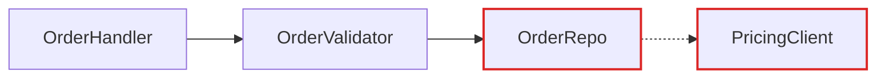
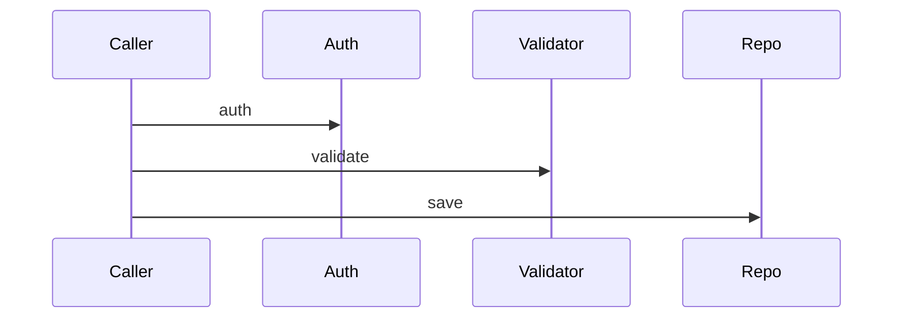
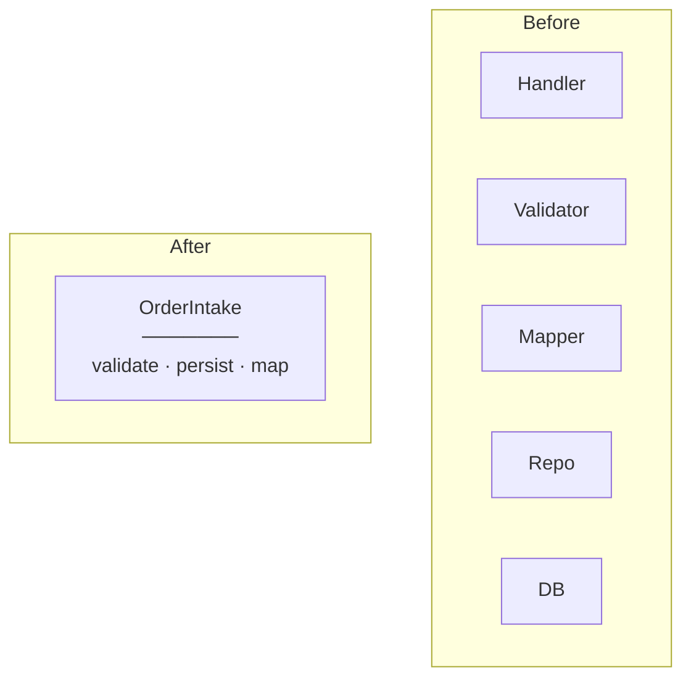
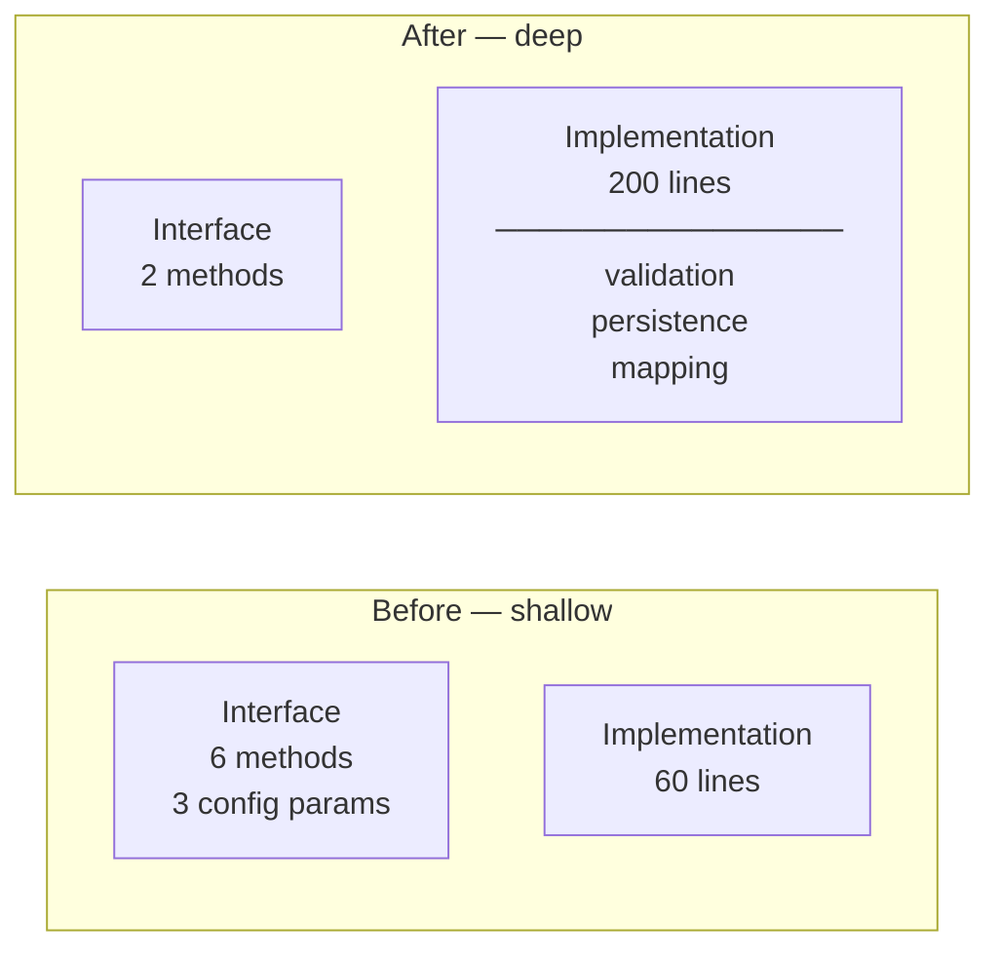
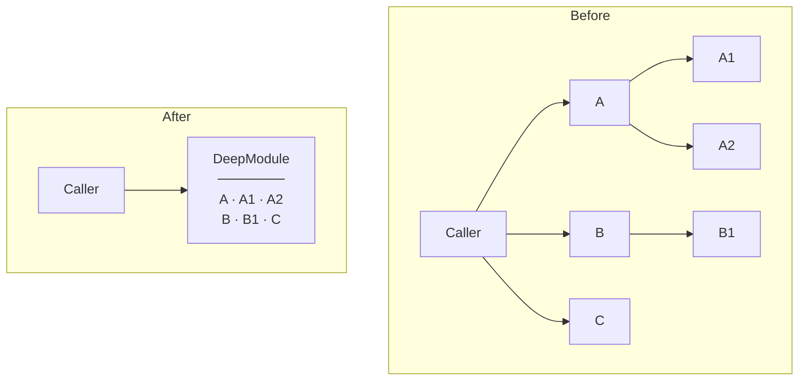

# Report Format

The architecture review is written directly to stdout as markdown. Diagrams use Mermaid code fences — they render natively on GitHub, GitLab, and most markdown viewers.

The format is editorial, not corporate. Lean prose, generous whitespace, diagrams carrying the weight.

## Output structure

```
# Architecture Review — {{repo name}}
{{date}}

## Candidates

### {{Candidate title}}
**Badges:** `Strong` · `in-process`

**Files:** `src/a.ts` `src/b.ts` `src/c.ts`


**Problem:** One sentence. What hurts.

**Solution:** One sentence. What changes.

**Wins:**
- Tests hit one interface
- Pricing logic stops leaking
- Delete 4 shallow wrappers

### {{Next candidate}}
...

## Top recommendation

{{Candidate name}} — one sentence on why. Anchor link to its section.
```

## Diagram patterns

Pick the pattern that fits the candidate. Mix them. Don't make every diagram look the same.

### Mermaid graph (the workhorse for dependencies / call flow)

Use a Mermaid `flowchart` or `graph` when the point is "X calls Y calls Z, and look at the mess." Style with `classDef` to colour leakage edges red and the deep module dark.

````markdown

````

For **before / after** — present two diagrams side by side in the markdown, separated by a heading:

```markdown
#### Before


#### After


```

Sequence diagrams work well for "before: 6 round-trips; after: 1."

````markdown

````

### Cross-section (good for layered shallowness)

Stack horizontal bands to show layers a call passes through. Before: 6 thin layers each doing nothing. After: 1 thick band labelled with the consolidated responsibility.

````markdown

````

### Mass diagram (good for "interface as wide as implementation")

Two rectangles per module — one for interface surface area, one for implementation. Before: interface rectangle is nearly as tall as the implementation rectangle (shallow). After: interface rectangle is short, implementation rectangle is tall (deep).

````markdown

````

### Call-graph collapse

Before: a tree of function calls. After: the same tree collapsed into one box, with the now-internal calls listed inside.

````markdown

````

## Mermaid styling reference

```mermaid
  classDef deep fill:#1e293b,color:#fff,stroke:#0f172a,stroke-width:2px;
  classDef leak stroke:#dc2626,stroke-width:2px;
  classDef seam stroke-dasharray:4 4;
  classDef adapter fill:#f1f5f9,stroke:#94a3b8;
```

## Tone

Use exactly: **module**, **interface**, **implementation**, **depth**, **deep**, **shallow**, **seam**, **adapter**, **leverage**, **locality**.

Never substitute: component, service, unit (for module) · API, signature (for interface) · boundary (for seam) · layer, wrapper (for module, when you mean module).

**Phrasings that fit the style:**

- "Order intake module is shallow — interface nearly matches the implementation."
- "Pricing leaks across the seam."
- "Deepen: one interface, one place to test."
- "Two adapters justify the seam: HTTP in prod, in-memory in tests."

**Wins bullets** name the gain in glossary terms: *"locality: bugs concentrate in one module"*, *"leverage: one interface, N call sites"*, *"interface shrinks; implementation absorbs the wrappers"*. Don't write *"easier to maintain"* or *"cleaner code"* — those terms aren't in the glossary and don't earn their place.

No hedging, no throat-clearing, no "it's worth noting that…". If a sentence could be a bullet, make it a bullet. If a bullet could be cut, cut it. If a term isn't in [LANGUAGE.md](LANGUAGE.md), reach for one that is before inventing a new one.
