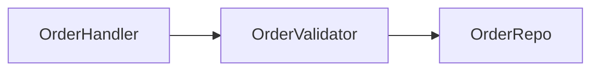

# Improve Codebase Architecture

Surface architectural friction and propose **deepening opportunities** — refactors that turn shallow modules into deep ones. The aim is testability and AI-navigability.

## Glossary

Use these terms exactly in every suggestion. Consistent language is the point — don't drift into "component," "service," "API," or "boundary." Full definitions in [LANGUAGE.md](LANGUAGE.md).

- **Module** — anything with an interface and an implementation (function, class, package, slice).
- **Interface** — everything a caller must know to use the module: types, invariants, error modes, ordering, config. Not just the type signature.
- **Implementation** — the code inside.
- **Depth** — leverage at the interface: a lot of behaviour behind a small interface. **Deep** = high leverage. **Shallow** = interface nearly as complex as the implementation.
- **Seam** — where an interface lives; a place behaviour can be altered without editing in place. (Use this, not "boundary.")
- **Adapter** — a concrete thing satisfying an interface at a seam.
- **Leverage** — what callers get from depth.
- **Locality** — what maintainers get from depth: change, bugs, knowledge concentrated in one place.

Key principles (see [LANGUAGE.md](LANGUAGE.md) for the full list):

- **Deletion test**: imagine deleting the module. If complexity vanishes, it was a pass-through. If complexity reappears across N callers, it was earning its keep.
- **The interface is the test surface.**
- **One adapter = hypothetical seam. Two adapters = real seam.**

This skill is _informed_ by the project's domain model. The domain language gives names to good seams; ADRs record decisions the skill should not re-litigate.

## Process

### 1. Explore

First, read the project's `CONTEXT.md` (domain glossary) and `docs/adr/` (recorded decisions). If neither exists, the project hasn't been onboarded to the wiki skill — skip the domain-language check and work from the code's own naming.

Then explore the codebase directly using shell tools (`find`, `rg`, `fd`, `ls -R`), AST queries (`ast_grep_search`), and LSP navigation (`lsp_navigation`). Read key files. Don't follow rigid heuristics — explore organically and note where you experience friction:

- Where does understanding one concept require bouncing between many small modules?
- Where are modules **shallow** — interface nearly as complex as the implementation?
- Where have pure functions been extracted just for testability, but the real bugs hide in how they're called (no **locality**)?
- Where do tightly-coupled modules leak across their seams?
- Which parts of the codebase are untested, or hard to test through their current interface?

Apply the **deletion test** to anything you suspect is shallow: would deleting it concentrate complexity, or just move it? A "yes, concentrates" is the signal you want.

### 2. Present candidates as terminal output

Write the review directly to stdout — no file created, no browser opened. Use Mermaid code fences for diagrams. The output must be a formatted block in your response so the user reads it inline.

Diagrams use Mermaid syntax rendered as fenced code blocks:

```

```

**Diagram patterns** (see [REPORT.md](REPORT.md) for full guidance):
- **Mermaid graph** — call flows and dependencies
- **Cross-section** — horizontal bands showing layer depth
- **Mass diagram** — compare interface surface area to implementation
- **Call-graph collapse** — nested boxes collapsing into one deep module

Each candidate is a clear section. Use markdown headings and blocks:

- **Title** — short, names the deepening
- **Badges** — recommendation strength: `Strong` / `Worth exploring` / `Speculative`, plus a tag for the dependency category (`in-process`, `local-substitutable`, `ports & adapters`, `mock`)
- **Files** — which files/modules are involved
- **Before / After diagram** — the centrepiece. Two Mermaid diagrams or one showing the collapse.
- **Problem** — one sentence. What hurts.
- **Solution** — one sentence. What changes.
- **Wins** — bullets, ≤6 words each. e.g. "Tests hit one interface", "Pricing logic stops leaking", "Delete 4 shallow wrappers"
- **ADR callout** (if applicable) — a note if the candidate contradicts an existing ADR

End with a **Top recommendation** section: which candidate you'd tackle first and why.

**Use CONTEXT.md vocabulary for the domain, and [LANGUAGE.md](LANGUAGE.md) vocabulary for the architecture.** If `CONTEXT.md` defines "Order," talk about "the Order intake module" — not "the FooBarHandler," and not "the Order service."

**ADR conflicts**: if a candidate contradicts an existing ADR, only surface it when the friction is real enough to warrant revisiting the ADR. Mark it clearly (e.g. a callout: _"Contradicts ADR-0007 — but worth reopening because…"_). Don't list every theoretical refactor an ADR forbids.

See [REPORT.md](REPORT.md) for diagram patterns and formatting guidance.

Do NOT propose interfaces yet. After writing the review, ask the user: "Which of these would you like to explore?"

### 3. Grilling loop

Once the user picks a candidate, drop into a grilling conversation. Walk the design tree with them — constraints, dependencies, the shape of the deepened module, what sits behind the seam, what tests survive.

Side effects happen inline as decisions crystallize:

- **Naming a deepened module after a concept not in `CONTEXT.md`?** Add the term to `CONTEXT.md` — same discipline as `/grill-with-docs` (see [CONTEXT-FORMAT.md](../grill-with-docs/CONTEXT-FORMAT.md)). Create the file lazily if it doesn't exist.
- **Sharpening a fuzzy term during the conversation?** Update `CONTEXT.md` right there.
- **User rejects the candidate with a load-bearing reason?** Offer an ADR, framed as: _"Want me to record this as an ADR so future architecture reviews don't re-suggest it?"_ Only offer when the reason would actually be needed by a future explorer to avoid re-suggesting the same thing — skip ephemeral reasons ("not worth it right now") and self-evident ones. See [ADR-FORMAT.md](../grill-with-docs/ADR-FORMAT.md).
- **Want to explore alternative interfaces for the deepened module?** See [INTERFACE-DESIGN.md](INTERFACE-DESIGN.md).
